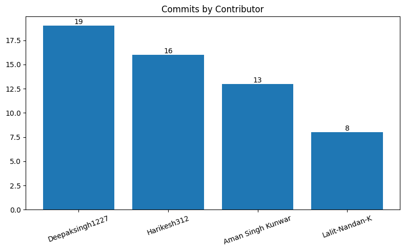
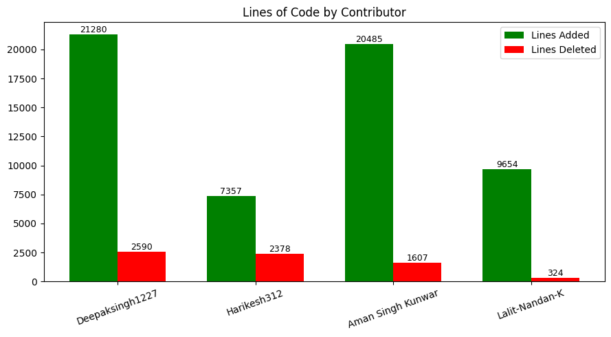

## Our Team

We are a team of Computer Science Engineering students from **Dev Bhoomi Uttarakhand University** who developed **ADHYAN.AI**, a web-based academic platform designed to support classroom management, assessment automation, and student feedback in digital learning environments.

The team comprises:

- **Deepak Singh Rawat**, **Harikesh Kumar**, and **Lalit Nandan** — B.Tech CSE **3rd Year**
- **Aman Singh Kunwar** — B.Tech CSE **2nd Year**

The goal of this project is to combine modern full-stack development practices with practical educational needs to create a scalable and user-friendly system.

---

## Contributors & Their Work

> All contributors participated equally in system design, coding, logic building, testing, debugging, performance tuning, and documentation.  
> The sections below clearly define **primary ownership and major responsibilities** of each contributor.

---

### 1. Deepak Singh Rawat (Team Lead) — B.Tech CSE 3rd Year

**Role:** Backend Developer & System Architect  
**GitHub:** https://github.com/Deepaksingh1227

**Primary Responsibility:** Complete backend system, real-time infrastructure, AI services, and security.

**Technologies:**  
Node.js, Express.js, MongoDB, Mongoose, REST APIs, Socket.IO, WebRTC, JWT, bcrypt, Multer, Cloudinary, GridFS, PDF Parse, Mammoth, **Google Gemini Flash 2.5**, **Bravo API**, dotenv, nanoid, PM2, Git

**Contributions:**

- Designed and implemented the **complete backend** architecture and modular API structure
- Built REST APIs for classrooms, quizzes, assignments, test papers, profiles, media, and feedback handling
- Integrated AI-powered quiz, test paper, and assignment generation using **Gemini Flash 2.5**
- Implemented **live meeting and real-time classroom interaction system** using WebRTC and Socket.IO
- Designed secure authentication and authorization mechanisms using JWT and bcrypt
- Built scalable file upload and media handling pipelines using Multer, Cloudinary, and GridFS
- Implemented document parsing pipelines for PDF and DOCX files
- Integrated email and notification services using **Bravo API**
- Designed optimized MongoDB schemas, indexing, and query structures
- Ensured backend stability, security, scalability, and integration with frontend applications

---

### 2. Harikesh Kumar — B.Tech CSE 3rd Year

**Role:** Full Stack Developer (Landing Page, Deployment & Platform Integration)  
**GitHub:** https://github.com/Harikesh312

**Primary Responsibility:** Public landing page, deployment & hosting, performance optimization, and academic event systems.

**Technologies:**  
React 19, Vite, Tailwind CSS, Axios, React Router, Node.js, Express.js, MongoDB, Render, Git

**Contributions:**

- Designed and developed the complete **public landing page** with responsive and SEO-friendly layout
- Deployed and hosted frontend and backend services on **Render**
- Configured production environments, environment variables, and service connections
- Implemented frontend performance optimizations including lazy loading, code splitting, and memoization
- Integrated both Teacher and Student panels with backend APIs
- Designed and implemented **announcements system** for academic communication
- Built **calendar management** for classes and academic schedules
- Implemented **upcoming events and notification display system**
- Optimized API usage and frontend data flow for smooth user experience
- Managed cross-module integration, merge resolution, and documentation support

---

### 3. Aman Singh Kunwar — B.Tech CSE 2nd Year

**Role:** Frontend Developer (Teacher Panel)  
**GitHub:** https://github.com/Aman-Singh-Kunwar

**Primary Responsibility:** Teacher-facing dashboard and academic workflow interfaces.

**Technologies:**  
React 19, Vite, Tailwind CSS, JavaScript, HTML, CSS, Axios, React Router, jsPDF, xlsx, UUID, Git

**Contributions:**

- Designed and implemented the complete **Teacher Dashboard UI**
- Built interfaces for assignment creation, quiz management, test evaluation, and result viewing
- Implemented secure authentication and protected routing for teachers
- Added theme customization and UI personalization options
- Integrated PDF and Excel export features for academic records
- Optimized responsiveness and layout across screen sizes
- Fixed UI bugs and improved interaction consistency

---

### 4. Lalit Nandan — B.Tech CSE 3rd Year

**Role:** Frontend Developer (Student Panel)  
**GitHub:** https://github.com/Lalit-Nandan-K

**Primary Responsibility:** Student-facing experience and feedback systems.

**Technologies:**  
React 19, Vite, Tailwind CSS, JavaScript, HTML, CSS, Axios, React Router, Framer Motion, Lucide Icons, FullCalendar, Git

**Contributions:**

- Designed and implemented the **Student Dashboard UI** with focus on usability
- Built navigation, course browsing, and enrollment flows
- Designed and implemented the **feedback system for both Student and Teacher panels**
- Integrated feedback submission, viewing, and management interfaces
- Implemented animations and smooth UI transitions
- Added search, filtering, and pagination features
- Ensured responsive behavior across mobile, tablet, and desktop devices
- Stabilized UI during feature integration and major merges

---

## Contributor Activity

### 🔹 Commit Contribution

| Contributor       | Commits | Contribution % |
| ----------------- | ------- | -------------- |
| Deepaksingh1227   | 19      | 33.93%         |
| Harikesh312       | 16      | 28.57%         |
| Aman-Singh-Kunwar | 13      | 23.21%         |
| Lalit-Nandan-K    | 8       | 14.29%         |
| **Total**         | **56**  | **100%**       |

---

### 🔹 Code Contribution (Lines of Code)

| Contributor       | Lines Added | Lines Deleted | Contribution % |
| ----------------- | ----------- | ------------- | -------------- |
| Deepaksingh1227   | +21,280     | -2,590        | 36.21%         |
| Aman Singh Kunwar | +20,485     | -1,607        | 34.85%         |
| Lalit-Nandan-K    | +9,654      | -324          | 16.43%         |
| Harikesh312       | +7,357      | -2,378        | 12.52%         |
| **Total**         | **58,776**  | —             | **100%**       |

### Live contributor graph:

[View Contributors Graph](https://github.com/HacktheWinter/ADHYAN.AI/graphs/contributors)

### Contributor Chart Placeholder

---

## Conclusion

This project reflects our collective effort to apply software engineering, full-stack development, and AI-driven concepts to a real-world educational problem. Each team member played a distinct role in shaping the platform, and together we ensured that the system is scalable, maintainable, and aligned with modern development practices.

ADHYAN.AI stands as a result of teamwork, continuous learning, and practical application of classroom knowledge to build a meaningful digital solution for education.
