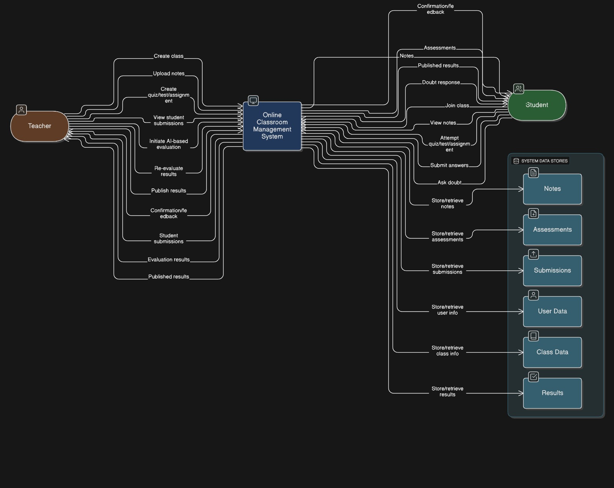
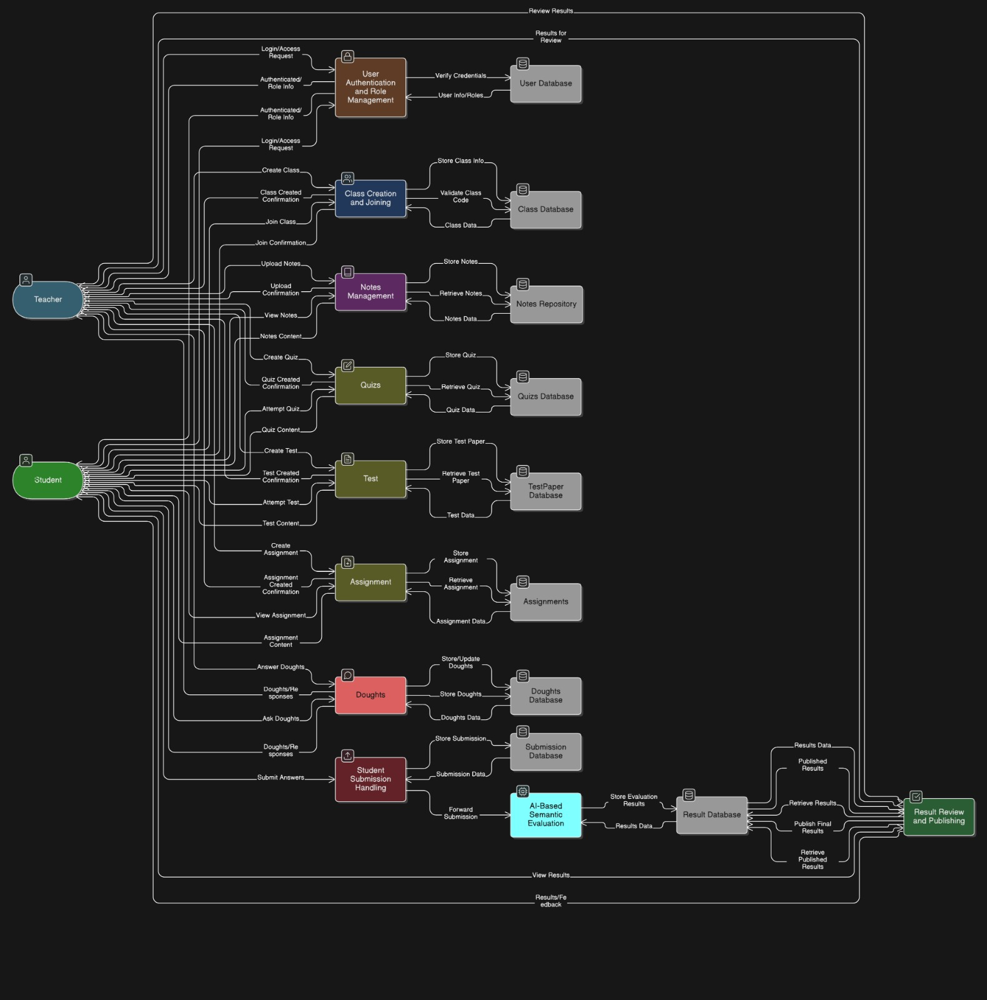
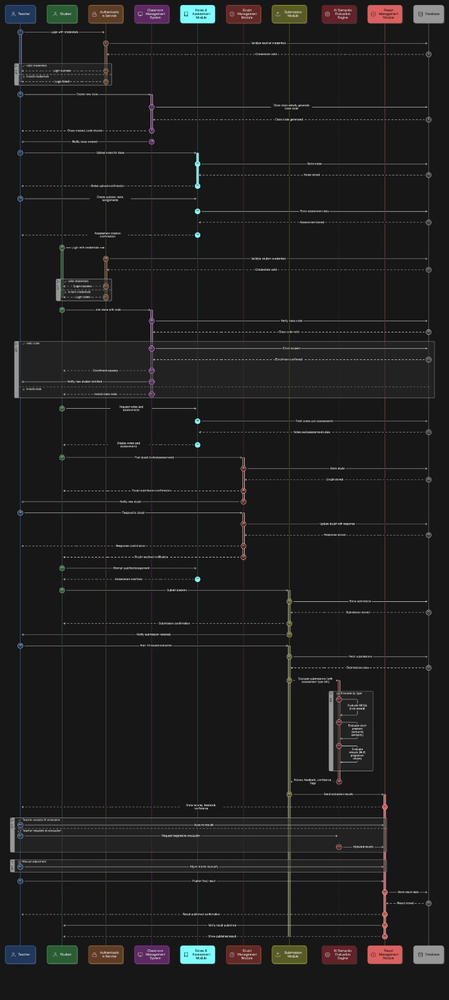
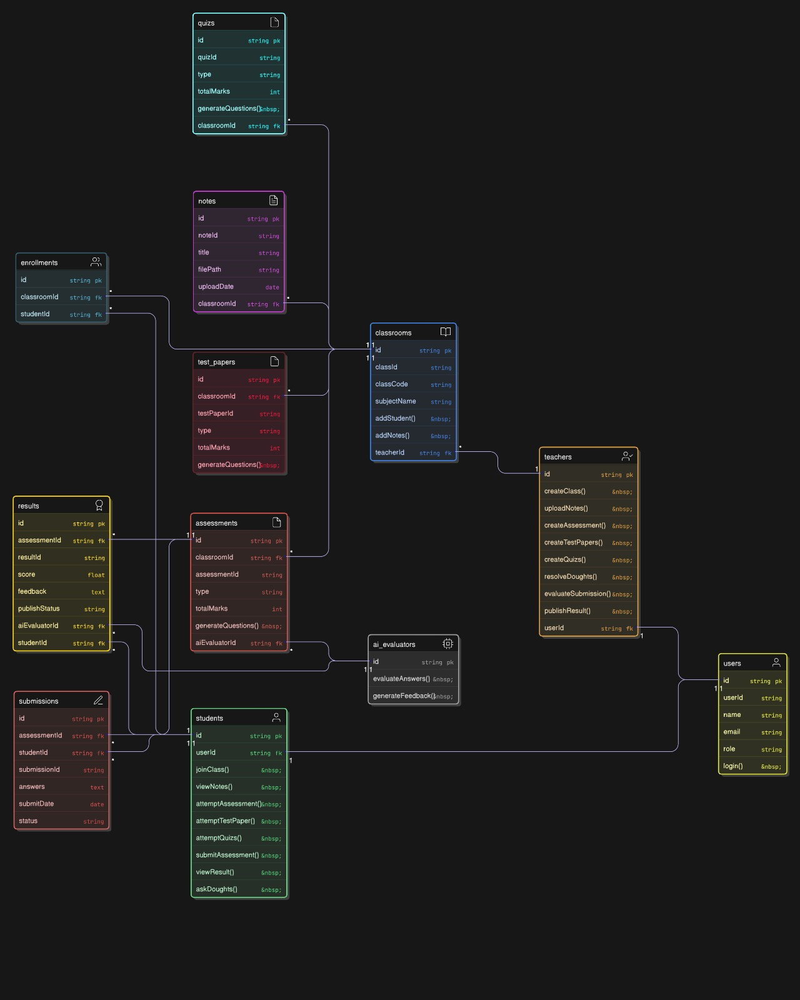

# ADHYAN.AI Design Diagrams

This document details the architectural design and logical flow of the ADHYAN.AI platform, specifically focusing on the AI-driven educational features.

## 1. Context Diagram

**Diagram Overview:**
This Context Diagram provides the highest-level view of the ADHYAN.AI system boundary. It identifies the **ADHYAN.AI Platform** as the core system and maps its interactions with external entities:
- **Teachers:** Who input lecture notes and manage assessments.
- **Students:** Who take assessments and receive feedback.
- **External AI Services (Gemini/OpenAI):** Which the system queries for question generation and grading logic.
- **Administrators:** Who oversee system health and user management.
This diagram establishes the scope of the project and clarifies what lies inside versus outside the automation boundary.

---

## 2. Data Flow Diagram

**Diagram Overview:**
This Data Flow Diagram (DFD) illustrates how information moves through the ADHYAN.AI system.
- **Input:** Lecture PDF/Text flows from the Teacher to the "Content Processing Module".
- **Process:** The data is transformed into structured JSON Quizzes by the "AI Generation Engine".
- **Storage:** Generated quizzes are stored in the "Assessments Database".
- **Output:** Student answers flow back into the "Grading Module", which retrieves answer keys from storage, compares them, and outputs a "Performance Report".
It highlights the transformation of unstructured data (notes) into structured actionable data (graded results).

---

## 3. Activity Diagram

**Diagram Overview:**
This Activity Diagram details the step-by-step workflow for the **"AI Question Generation"** process.
- **Start:** Teacher initiates a request.
- **Action:** System validates the file format and user quota.
- **Action:** System extracts text from the uploaded document.
- **Decision:** If text is sufficient -> Send to AI Model; Else -> Return Error.
- **Action:** AI Model generates questions.
- **Action:** System parses and displays questions for review.
- **End:** Teacher saves the quiz.
This specifically models the operational logic and decision points involved in creating a new assessment.

---

## 4. Sequence Diagram

**Diagram Overview:**
The Sequence Diagram captures the runtime interaction between the system's objects during the **"Student Assignment Submission"** scenario.
1. **StudentUI** sends `uploadSubmission()` to the **BackendAPI**.
2. **BackendAPI** calls `OCRService` to `extractText()`.
3. **OCRService** returns raw text.
4. **BackendAPI** calls `AIService` with `evaluate(text, answerKey)`.
5. **AIService** returns `grade` and `feeback`.
6. **BackendAPI** saves the result to **Database** and returns success to **StudentUI**.
This visualization is critical for understanding the API call chains and latency dependencies.

---

## 5. Class Diagram

**Diagram Overview:**
The Class Diagram defines the static structure of the ADHYAN.AI application code.
- **User Hierarchy:** Shows a base `User` class extended by `Student` and `Teacher` classes with specific permissions.
- **Core Models:** `Course`, `Quiz`, `Question`, and `Submission` classes are depicted with their attributes (e.g., `difficultyLevel`, `marks`) and methods (e.g., `calculateScore()`).
- **Relationships:** Illustrates that a `Course` *has many* `Quizzes`, and a `Student` *creates many* `Submissions` for those quizzes.
This blueprint guides the database schema design and object-oriented programming implementation.
