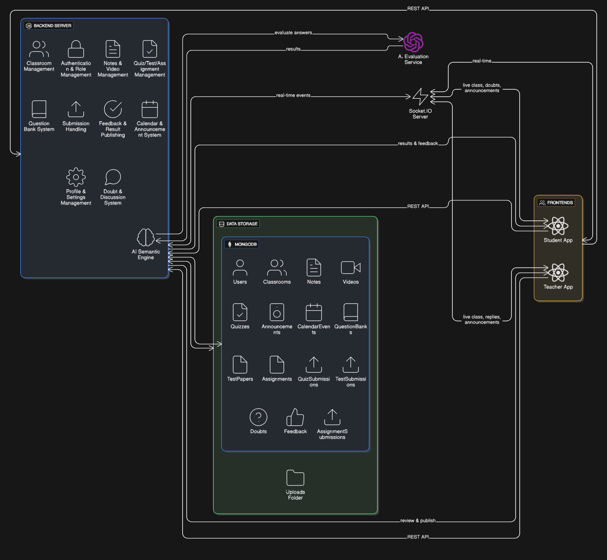
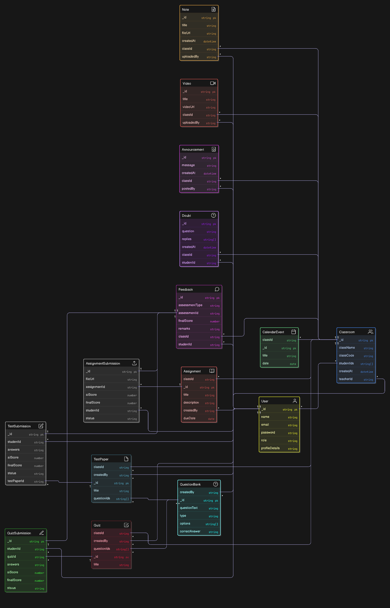

# ADHYAN.AI – Design Diagrams

This section explains the three core design diagrams used in the ADHYAN.AI system. Together, these diagrams describe how the platform is structured, how data moves, and how information is stored.

## 1. High-Level System Architecture Diagram

**Purpose:**
This diagram shows the overall structure of the **ADHYAN.AI** platform and how its major components interact.

**Explanation:**
ADHYAN.AI consists of two main user interfaces:
- **Student Web App**
- **Teacher Web App**
Both applications are built using React and connect to a centralized backend server built using Node.js and Express.

# The backend acts as the brain of the system. It handles:
- Authentication and role management
- Class creation and joining
- Notes, quizzes, tests, and assignments
- Student submissions
- AI-based evaluation
- Result publishing
- Real-time doubts and classroom interactions

# The backend communicates with:
- MongoDB to store all system data
- File Storage to store notes, videos, and uploaded answer files
- AI Evaluation Engine to perform semantic analysis of student answers
- Socket.IO to provide real-time features like live doubts and replies

This architecture ensures that both teachers and students use a single, consistent backend while maintaining separate interfaces.

---

## 2. Data Flow Diagram (DFD)

**Purpose:**
This diagram shows how data moves through ADHYAN.AI when users interact with the system.

**Explanation:**
Students and teachers send data into the system through their web applications.
This data flows into different processes such as:
- Authentication
- Class management
- Notes management
- Quiz, test, and assignment handling
- Submission processing
- AI evaluation
- Result publishing
- Doubts and discussions

1. When a teacher creates a class, quiz, or assignment, the information is stored in the respective databases.
2. When a student submits answers, the data is stored in the Submission Database and sent to the AI Evaluation Engine.
3. The AI analyzes the answers and returns scores, which are saved in the Result Database.

**Teachers** can review or modify these results and then publish them.
**Students** can later view their final results and feedback.

- Doubts raised by students are stored in the Doubts Database and shared in real-time with teachers and classmates.

This diagram clearly shows how information flows from users, through processing units, into storage, and back to users.

---

## 3. Database Schema

**Purpose:**
This diagram shows how data is organized and related inside the ADHYAN.AI database.

**Explanation:**
The database contains multiple entities that represent real-world objects in the system:
- User stores student and teacher accounts
- Classroom stores class information and enrolled users
- Note, Video, Announcement, CalendarEvent store learning content
- Quiz, TestPaper, Assignment store assessments
- QuizSubmission, TestSubmission, AssignmentSubmission store student answers
- Feedback stores final evaluated results
- Doubt stores student questions and teacher replies

# Relationships between these entities show:
- Teachers create classrooms
- Students join classrooms
- Classrooms contain quizzes, tests, assignments, notes, and doubts
- Students submit answers for assessments
- Each submission produces feedback
- Doubts belong to a classroom and a student

This schema ensures that all academic activities are properly connected and traceable.